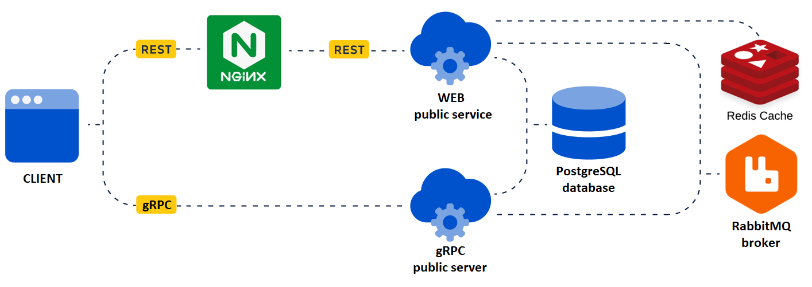

# API сервис управления книгами


Реализация асинхронного сервиса с микросервисной архитектурой.
Тестовое задание.

## Автор:
Алексей Наумов ( algena75@yandex.ru )
## Используемые технологии:
* FastAPI
* PostgreSQL
* JWT
* Swagger
* gRPC
* RabbitMQ
* Asyncio
* SQLAlchemy + Alembic
* Pytest
* Docker
* Nginx
## Как запустить проект:
Клонировать репозиторий и перейти в него в командной строке:


```
git clone git@github.com:algena75/book_service.git
```

```
cd book_service
```

### Запуск виртуального окружения

Создание виртуального окружения:
```bash
poetry env use python3.10
```
Установка зависимостей:
```bash
poetry install --with test,web,grpc_service
```
Запуск оболочки и активация виртуального окружения (из папки проекта):
```bash
poetry shell
```
Проверка активации виртуального окружения:
```bash
poetry env list
```
## Подготовка:
Создать в корне проекта файл `.env` (см `.env.example`) для подключения БД, gRPC-сервера и брокера RabbitMQ.

* #### для запуска проекта в контейнерах выполнить:
    ```bash
    docker compose -f docker-compose.yml up -d
    ```
Oткрыть в браузере ` http://127.0.0.1/docs `.
Будет создано 5 контейнеров. Публичный web принимает через REST API наименование книги и автора, также позволяет 
редактировать записи. Все CRUD-операции доступны только аутентифицированным пользователям. Все данные хранятся 
в БД PostgreSQL. Создание БД и первого суперпользователя происходит автоматически. При изменении записей о книгах 
отправляется сообщение в брокер RabbitMQ.
В контейнере grpc_server организована многопоточная система. Параллельно работают сервер и получатель сообщений 
брокера. Сообщения брокера логируются в лог-файлы и дублируются в консоль.
Реализована JWT авторизация и аутентификация. Регистрация пользователя доступна по адресу ` http://127.0.0.1/auth/register `,
получение токена: ` http://127.0.0.1/auth/jwt/login `. Для тестирования gRPC через Postman используйте proto-файл
` protobufs/booj_service.proto `. Логфайлы gRPC-сервера сохраняются в контейнере и пробрасываются в локальный репозиторий.